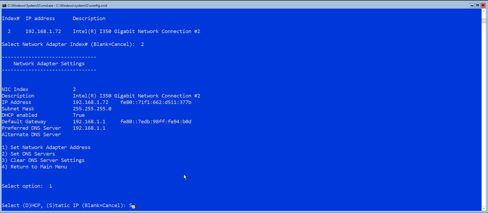
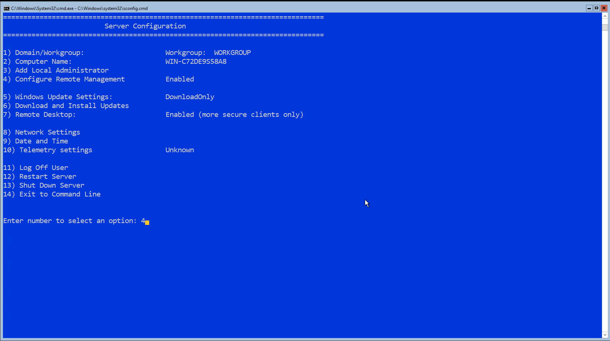
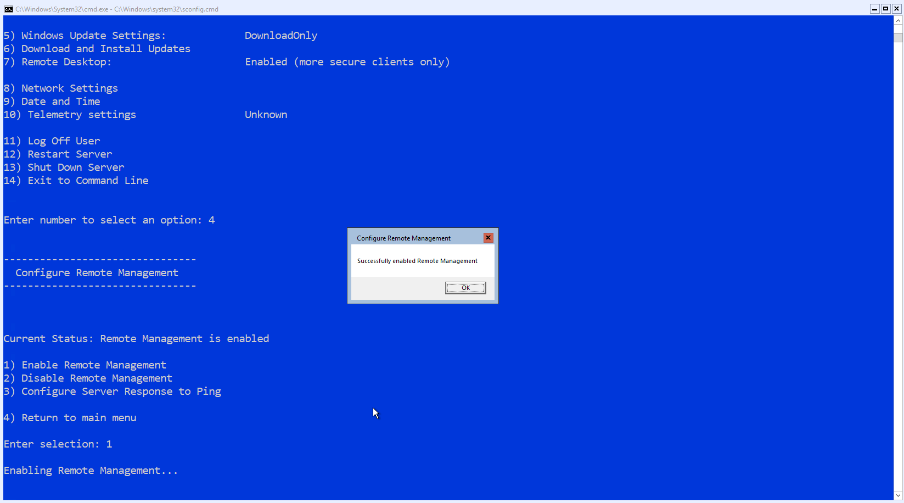
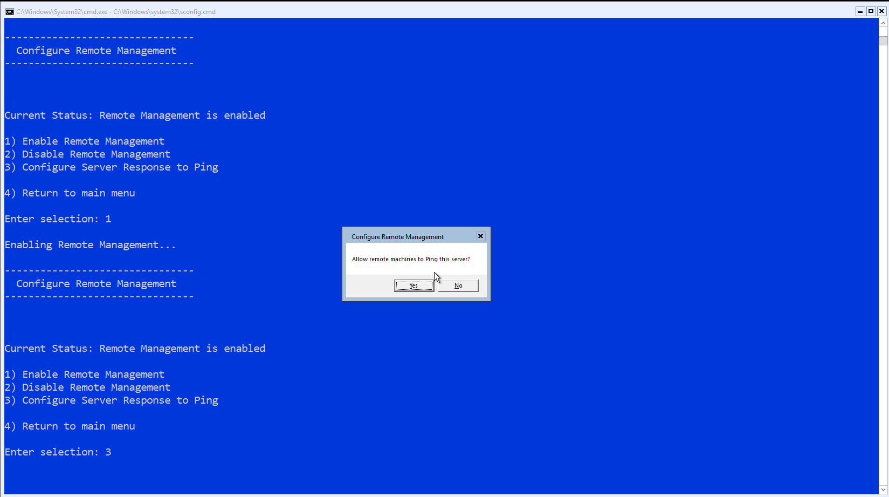
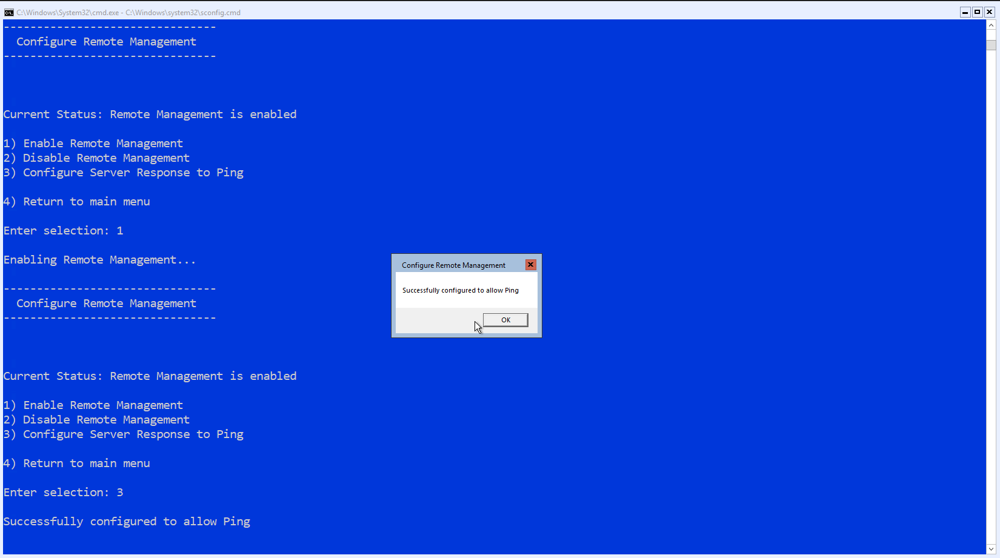

# Hyper-V Workgroup Installation
HyperV Server core 2019 configuration in a workgroup environment

# 

# Background
The steps provided below are to configure Hyper-V server core in a workgroup environment which has some unique configurations that need to be done which are not involved in a domain environment. In this environment we will use a Windows 10 Pro machine for remote management of the HyperV server.

# 

# Needed Material
* Media, such as flash drives, to perform installtions of Windows desktop and server on two machines. The drive used for the Hyper-V Server installer should be at least 4 GB and the drive used for the Windows 10 Pro installer should be at least 8 GB.
* [Microsoft Hyper-V Server 2019 ISO](https://www.microsoft.com/en-us/evalcenter/evaluate-hyper-v-server-2019)
* Windows 10 Pro ISO or flash drive installer which can be created using the [Microsoft Windows 10 Installation Tool](https://www.microsoft.com/en-us/software-download/windows10) or using [Rufus](https://rufus.ie/) if you already have an ISO.
* A desktop for remote management of the HyperV server
* A server to run HyperV server

# 

# Prerequisites

### 1. [Create Hyper-V Server Installer](#Create-Hyper-V-Server-USB-Installer)
### 2. [Hyper-V Server Installation](#Install-Hyper-V-Server)
### 3. [Create Windows 10 Pro Installer](#Create-Windows-10-Pro-USB-Installer)
### 4. [Windows 10 Pro Installation](#Install-Windows-10-Pro)

<br>

## Prerequisite Steps

### Create Hyper-V Server USB Installer

[Back To Prerequisites Summary](#Prerequisites)

[Back To Top](#Background)

<br>

**(1)** Download the HyperV Server ISO from the Microsoft evaluation center. In this environment we will use the 2019 edition of Hyper-V Server which can be downloaded [Here](https://www.microsoft.com/en-us/evalcenter/evaluate-hyper-v-server-2019).

**(2)** Download [Rufus](https://rufus.ie/), which is the tool we will use to create the USB installer.

**(3)** With the USB drive you would like to use for the Hyper-V Server installtion connected, run Rufus. Notice how Rufus detects your USB drive, if the incorrect drive is selected please select it using the Device drop down.


**(4)** Under **Boot selection** verify **Disk or ISO image** is selected. Then click the "Select" button to open a file browser. Select the Hyper-V Server ISO downloaded in step 2 and click Open. Notice that the text for **Boot selection** now shows the ISO filename.

**(5)** Under **Partition scheme** verify **MBR** is selected

**(6)** Under **Target system** verify **BIOS or UEFI** is selected

**(7)** Under **Volume label** you may rename your USB drive, in this example I named my drive **hyperv-server-install**

**(8)** Under **File system** verify **NTFS** is selected

**(9)** Review the image below to compare with your current settings. Once you confirm everything looks good press **Start** to begin formatting the USB drive and creating the Hyper-V server installer. Notice that, prior to pressing Start, the progress bar with the text READY is not filled.


**(10)** Rufus may prompt you that all the data on your USB drive will be destroyed. Press **OK** on the dialog box to continue with the process. You should see a progress bar under **Status**, monitor this to see when the process is complete.


**(11)** Once the process completes you should see the progress bar, with the text READY, is fully filled under **Status**, see image below. This means your installer was successfully created.


<br>

### Install Hyper-V Server

[Back To Prerequisites Summary](#Prerequisites)

[Back To Top](#Background)

<br>

Due to the range of motherboards, these steps are as generic as possible

**(1)** Verify your USB drive containing your Hyper-V Server installer is connected to your server.

**(2)** If your server is already powered on you should reboot or if it is powered off boot the server. During the boot process you should see a message stating which key you should press to show the boot menu. Press this key during the boot process to show the boot menu which lists bootable devices connected to your motherboard. For example, in the image below we see we should press F11 to show the boot menu.


Once you see the boot menu, boot from the USB drive containing your Hyper-V Server installer.

**(3)** Once the drive boots up you should see the Hyper-V Server setup UI appear. Follow the steps to install the Hyper-V Server operating system on your server. The process is the same as installing Windows, if this process is not clear please consult Google for visual guidance on the installation process. 

<br>

### Create Windows 10 Pro USB Installer

[Back To Prerequisites Summary](#Prerequisites)

[Back To Top](#Background)

<br>

If you already have a Windows 10 Pro ISO, you may follow the steps used to [create the Hyper-V Server installer](#Create-Hyper-V-Server-USB-Installer).

**(1)** Download and run the [Microsoft Windows 10 Installation Tool](https://www.microsoft.com/en-us/software-download/windows10)

**(2)** Verify the USB drive you would like to use for the Windows 10 Pro installation is connected

**(3)** Once the tool has loaded Accept the terms and conditions then make sure **Create installation media** is selected before clicking Next.


**(4)** If the recommended options are correct click Next, otherwise make sure you select the correct settings such as **Architecture**.


**(5)** Next you will be asked which type of media you would like to use. At this point you could select **ISO file** if you would like to generate an ISO file then you could follow the steps to [create the Hyper-V Server installer](#Create-Hyper-V-Server-USB-Installer). Or you can select **USB flash drive** to continue creating the Windows 10 Pro installer using the currently connected flash drive.


**(6)** Assuming you chose **USB flash drive** in the previous step, verify the correct USB drive is selected in the **Removable drives** tree as shown in the image below.


**(7)** After pressing Next, the tool will begin to download a copy of Windows 10 and create the USB installer. Please note all data on the USB drive will be overwritten.

**(8)** Once complete you should see a message stating **Your USB flash drive is ready** as shown in the image below.


**(9)** Press Finish so the tool can cleanup and close. Your drive is now ready to install Windows 10 Pro.

<br>

### Install Windows 10 Pro

[Back To Prerequisites Summary](#Prerequisites)

[Back To Top](#Background)

<br>

Due to the range of motherboards, these steps are as generic as possible

**(1)** Verify your USB drive containing your Windows 10 Pro installer is connected to your desktop.

**(2)** If your desktop is already powered on you should reboot or if it is powered off boot the desktop. During the boot process you should see a message stating which key you should press to show the boot menu. Press this key during the boot process to show the boot menu which lists bootable devices connected to your motherboard. For example, in the image below we see we should press F11 to show the boot menu.


Once you see the boot menu, boot from the USB drive containing your Windows 10 Pro installer.

**(3)** Once the drive boots up you should see the Windows 10 setup UI appear. Follow the steps to install the Windows 10 Pro operating system on your desktop. If this process is not clear please consult Google for visual guidance on the installation process. 

<br>

# 

<br>

## Quick Links

#### [Server Config](#Server-Configuration)
#### [Client Config](#Client-Configuration)

## 

<br>

# Server Configuration

### 1. [Network](#Network-Settings)

### 2. [Remote Management](#Remote-Management-Settings)

### 3. [Remote Desktop](#Remote-Desktop-Settings)

### 4. [Local Accounts](#Local-Account-Settings)

### 5. [Server Date and Time](#Date-And-Time-Settings)

### 6. [Server Name](#Server-Name-Settings)

<br>

## Server Configuration (SConfig) Window

After booting into Hyper-V Server you should be shown a command prompt window with a menu. This is the primary menu for configuring some general server settings.


## Server Configuration Steps

### Network Settings

[Next](#Remote-Management-Settings)

[Back To Server Configuration Summary](#Server-Configuration)

[Back To Top](#Background)

<br>

**(1)** In the SConfig window press 8 and enter to open the network settings for the server


**(2)** You are presented with a list of network adapters including index numbers. Enter the index number of the correct network adapter that is connected to the same network as your remote management machine.


**(3)** Now you are presented with a menu for managing the selected network adapter. Mainly we will set the IP address and DNS servers of the adapter (Options 1 and 2). First, select option 1 to set the nework adapter address.


**(4)** You are asked to select either DHCP or Static IP, Enter 'S' to choose a static IP



**(5)** Now you may enter the desired IP for the server and configure the other mandatory information. The default gateway address is the last configuration for this step. The following values were used in this environment

* IP Address - 192.168.1.100
* Subnet Mask - 255.255.255.0
* Default Gateway (Internal IP of home router) - 192.168.1.1


**(6)** After the IP address is changed you should see the menu presented in step 2. To configure the DNS servers of this adapter enter 2 to set the DNS servers.


**(7)** Now you will be asked to enter the preferred (Primary) DNS server. For this environment, the CloudFlare public DNS servers are used. These servers have a primary IP of 1.1.1.1 and a secondary IP of 1.0.0.1. You should see a confirmation the server was set.


**(8)** Now set the alternate (Secondary) DNS server, you should receive a confirmation the server was set.


**(9)** After you enter the alternate DNS server and it is set, you will be returned to the network settings menu in SConfig. Review the information to verify the adapter is configured correctly.

* IP Address should be set to the IP configured in step 5
* DHCP enabled should show a value of False
* Default gateway should be set to the IP configured in step 5
* Preferred and alternate DNS servers should be set to the IP's configured in steps 7 and 8

Once you confirm everything looks correct, enter 4 to return to the main SConfig menu


<br>

### Remote Management Settings

[Next](#Remote-Desktop-Settings)

[Back To Server Configuration Summary](#Server-Configuration)

[Back To Top](#Background)

<br>

**(1)** From the main menu in SConfig, enter 4 to configure remote management



**(2)** From the remote management window enter option 1 to verify that remote management is enabled. You should get a confirmation that it is enabled.



**(3)** Now enter 3 from the remote management menu to configure the server to respond to ping's. Once presented weith the dialog box, select Yes to allow remote machines to ping this server.



You will get a confirmation that pinging has been allowed



On the remote management menu enter 4 to return to the main menu in SConfig


<br>

### Remote Desktop Settings

[Next](#Local-Account-Settings)

[Back To Server Configuration Summary](#Server-Configuration)

[Back To Top](#Background)

<br>

**(1)** 


<br>

### Local Account Settings

[Next](#Date-and-Time-Settings)

[Back To Server Configuration Summary](#Server-Configuration)

[Back To Top](#Background)

<br>

**(1)** 


<br>

### Date and Time Settings

[Next](#Server-Name-Settings)

[Back To Server Configuration Summary](#Server-Configuration)

[Back To Top](#Background)

<br>

**(1)** 


<br>

### Server Name Settings

[Next](#Server-Configuration)

[Back To Server Configuration Summary](#Server-Configuration)

[Back To Top](#Background)

<br>

**(1)**


#

<br>

# Client Configuration

### 1. [Enable PSRemoting](#PSRemoting)

<br>

## Client Configuration Steps

### PSRemoting

[Next](#Client-Configuration)

[Back To Client Configuration Summary](#Client-Configuration)

[Back To Top](#Background)

<br>

**(1)** In the SConfig window press 8 and enter to open the network settings for the server

```Powershell
Enable-PSRemoting
```

<br>
