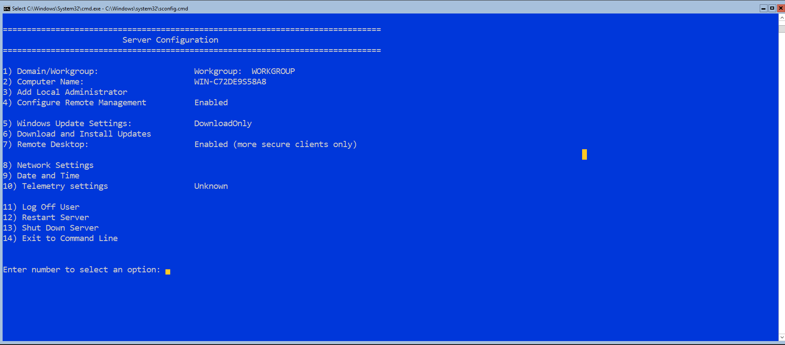
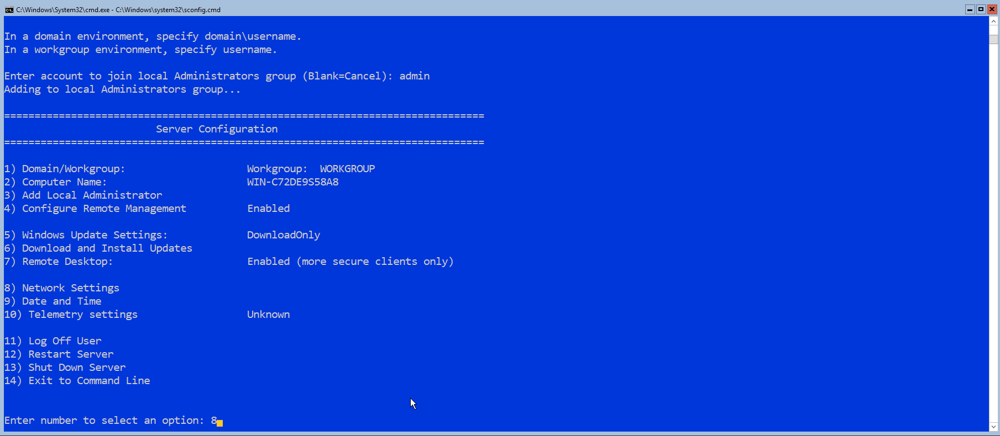
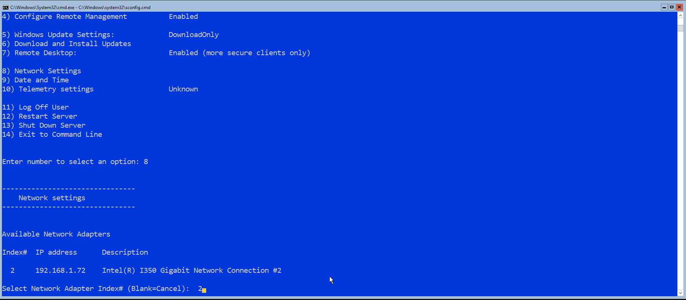
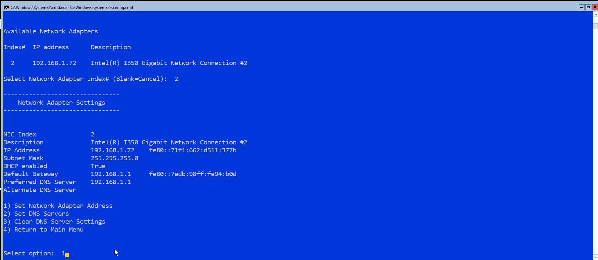
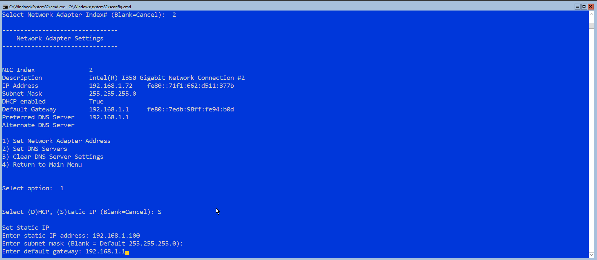
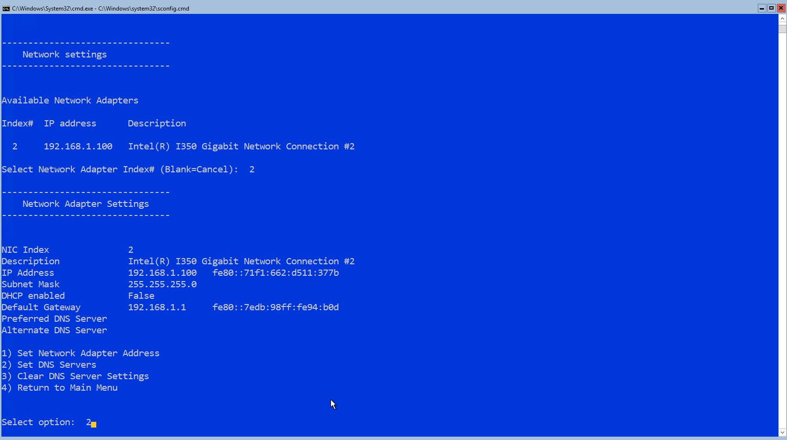
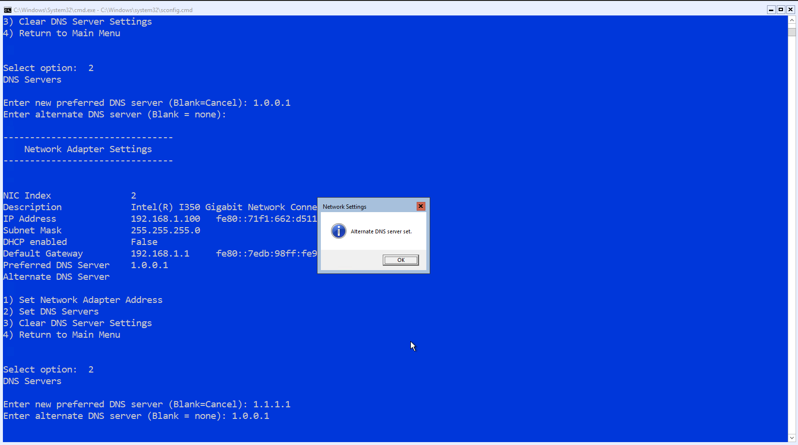

# HyperVWorkgroup
HyperV Server core 2019 configuration in workgroup environment

# Background
The steps provided below are to configure HyperV server core in a workgroup environment which has some unique configurations that need to be done which are not involved in a domain environment. In this environment we will use a Windows 10 Pro machine for remote management of the HyperV server.

## Needed Material
* Media, such as flash drives) to perform installtions of Windows desktop and server on two machines. The media should have a capacity between 4 to 8 GB.
* [Microsoft Hyper-V Server 2019 ISO](https://www.microsoft.com/en-us/evalcenter/evaluate-hyper-v-server-2019)
* Windows 10 Pro ISO or flash drive installer which can be created using the [Microsoft Windows 10 Installation Tool](https://www.microsoft.com/en-us/software-download/windows10) or using [Rufus](https://rufus.ie/) if you already have an ISO.
* A desktop for remote management of the HyperV server
* A server to run HyperV server

## Assumptions
It is assumed that you have already installed and are running a Windows 10 pro machine and have already installed HyperV server on your server machine.

# Server Configuration

## Server Configuration (SConfig) Window

Here is the main options menu when you load into HyperV server, this is used for quick configuration of the server.

## Configuration Steps

### Network Settings

To begin, we will set the server to a static IP so we do not have to access the server to find it's IP each time we want to connect.

1. In the SConfig window press 8 and enter to open the network settings for the server

2. You are presented with a list of network adapters including index numbers. Enter the index number of the correct network adapter that is connected to the same network as your remote management machine.

3. Now you are presented with a menu for managing the selected network adapter. Mainly we will set the IP address and DNS servers of the adapter (Options 1 and 2). First, select option 1 to set the nework adapter address.

4. You are asked to select either DHCP or Static IP, Enter 'S' to choose a static IP

(Network settings address type in SConfig](resources/images/4_network_address_type.png)

5. Now you may enter the desired IP for the server and configure the other mandatory information. The default gateway address is the last configuration for this step.

6. After the IP address is changed you should see the menu presented in step 2. To configure the DNS servers of this adapter enter 2 to set the DNS servers.

7. Now you will be asked to enter the preferred (Primary) DNS server. For this environment, the CloudFlare public DNS servers are used. These servers have a primary IP of 1.1.1.1 and a secondary IP of 1.0.0.1. You should see a confirmation the server was set.

8. Now set the alternate (Secondary) DNS server, you should receive a confirmation the server was set.

9. After you enter the alternate DNS server and it is set, you will be returned to the network settings menu in SConfig. Review the information to verify the adapter is configured correctly.

* IP Address should be set to the IP configured in step 5
* DHCP enabled should show a value of False
* Default gateway should be set to the IP configured in step 5
* Preferred and alternate DNS servers should be set to the IP's configured in steps 7 and 8

Once you confirm everything looks correct, enter 4 to return to the main SConfig menu

